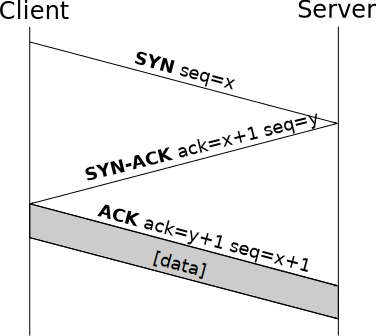

# Einleitung

Was lernst du in diesem Teil des Kurses?

<!-- TOC -->
* [Überblick zu Firewalls unter Linux](#überblick-zu-firewalls-unter-linux)
* [Überblick zu ```iptables```](#überblick-zu-iptables)
* [Debian-Systeme mit unkomplizierter Firewall (```ufw```)](#debian-systeme-mit-unkomplizierter-firewall-ufw)
* [RedHat-Systeme mit ```firewalld```](#redhat-systeme-mit-firewalld)
* [Das universellere Firewall-System ```nftables```](#das-universellere-firewall-system-nftables)
<!-- TOC -->

# Überblick zu Firewalls unter Linux

- ```iptables``` → hier begann alles
- ```ufw``` → für Debian-Systeme
- ```firewalld``` → für Redhat-Systeme
- ```nftables``` → universelles Firewall-System

# Überblick zu ```iptables```

Es gibt (hierarchisch von oben nach unten):

- Tabellen (**tables**), diese enthalten
- Regelketten (**chains**), davon gibt es vordefinierte und vom Benutzer erstellte Ketten, und in diesen stehen
- die eigentlichen Filterregeln (**rules**)

# Überblick zu ```iptables```

- mit ``````iptables`````` wird Netfilter, der IP-Paketfilter des Linux-Kernels konfiguriert
- Dokumentation unter [```man iptables```](https://man7.org/linux/man-pages/man8/iptables.8.html)
- Nachfolger ist ``````nftables``````

# Arten von Filter-Tabellen

folgende Regel-Tabellen hat ```iptables```:

| Tabelle  | Beschreibung                                                       |
|----------|--------------------------------------------------------------------|
| filter   | **Standard**tabelle enthält alle **reinen Filterregeln**           |
| nat      | für Adressumsetzung (NAT) und Port Forwarding eingesetzt           |
| mangle   | zur Manipulation von Paketen in Firewall eingesetzt                |
| raw      | Ausnahmen vom normalen  Connection Tracking oder sogar ausschalten |
| security | Wird für Systeme mit SELinux verwendet                             |

- jede Tabelle entspricht einem Satz von Regeln

# Arten von Regeln-Chains

Tabellen enthalten verschiedene Regelketten (Chains)

| Chain        | für Tabelle              | Wann?        | Beschreibung                                  | 
|--------------|--------------------------|--------------|-----------------------------------------------|
| INPUT        | mangle, nat, filter      | nach Routing | an lokalen IP-Adresse gerichtete Pakete       | 
| FOR-<br>WARD | mangle, filter           | nach Routing | Pakete von anderen Rechner für andere Rechner | 
| OUTPUT       | raw, mangle, nat, filter | vor Routing  | von lokalem Prozess stammende Pakete          |

- PREROUTING und POSTROUTING hier nicht relevant, weil sie nicht in der filter-Tabelle verwendet werden
- nicht jede Tabelle enthält alle Chains

# Policies

- aufgrund der vielen Möglichkeiten wird nicht für jedes Paket eine Filterregel existieren
- daher wird für jede Chain eine Policy vereinbart, die greift, wenn keine Filterregel zutrifft
- selbst definierte Chains können keine Policy haben (ist immer RETURN)

Policy besteht aus:

1. Name der Tabelle
2. Chain
3. Methode DROP oder ACCEPT

Beispiele:
```bash
# Policy verwirft alle Pakete der Tabelle filter in Chain INPUT
iptables -P INPUT DROP
# Policy akzeptiert alle Pakete der Tabelle mangle in Chain PREROUTING
iptables -t mangle -P PREROUTING ACCEPT 
```

# Allgemeines zur Arbeit mit ```iptables```

- Tabellen (wie ```filter```) enthalten Chains (wie ```INPUT```) mit Regeln
- für ``````iptables`````` sind immer ```root```-Rechte notwendig
- Optionen immer in einheitlicher Reihenfolge angeben = bessere Übersichtlichkeit

# Aufbau von Befehlen in ```iptables```

genereller Aufbau so:
```bash
iptables [Stelle-im-Regelwerk-und-Art-der-Bearbeitung] \
  [Eigenschaft-des-IP-Pakets] ... \
  [Aktion]
```

Beispiel:
```bash
iptables -A INPUT \
  -p tcp --dport ssh \
  -j ACCEPT
```

# Installation von ```iptables``` und ```iptables-persistent```

Debian:
```bash
sudo apt install iptables
sudo apt install iptables-persistent
```

Redhat:
```bash
sudo dnf install iptables
sudo dnf install iptables-persistent
```

- ```iptables-persistent```: Bestätigung für IPv4/6 im Terminal nötig

# Aktuelle Konfiguration für IPv4/v6 ansehen

```bash
sudo iptables -L [-v]
sudo ip6tables -L [-v]
```

# Beispiel für die Arbeit mit ```iptables```

1. Regeln hinzufügen:
```bash
# erlaube Pakete von Servern, zu denen der Host bereits 
# Verbindung aufgebaut hat, z. B. Webseite aufgerufen
sudo iptables -A INPUT -m conntrack \ 
  --ctstate ESTABLISHED,RELATED -j ACCEPT
# erlaube SSH
sudo iptables -A INPUT -p tcp --dport ssh -j ACCEPT
# verwerfe alle anderen nicht explizit erlaubten Pakete
sudo iptables -P INPUT DROP
# Verkehr vom Loopback-Interface erlauben
sudo iptables -I INPUT 1 -i lo -j ACCEPT
# wichtig, damit Hostname von Firewall aufgelöst werden kann
```
- für `ip6tables` wiederholen

# Beispiel für die Arbeit mit ```iptables```

verwendete Optionen:

- ```A INPUT``` = append, also nach anderen Regeln anhängen
- ```-m conntrack``` = Modul für Connection Tracking
- ```--ctstate``` = Connection State
- ```-j``` = jump springt zu einem spezifischen Ziel
- ```-p tcp``` = TCP Protokoll
- ```-P``` = Policy
- ```--dport``` = default Port
- ```-I INPUT 1``` = insert für INPUT an 1. Stelle
- ```-i``` = interface

# DROP versus REJECT

DROP:

- Firewall blockiert Pakete
- und informiert Absender nicht

REJECT:

- Firewall blockiert Pakete
- und informiert Absender

Fazit:

- also **DROP** benutzen = schwerer für Angreifer die Firewall-Config zu durchschauen

# Policy versus Rule

- diese Regel ```sudo iptables -A INPUT -j DROP``` immer **am Ende** einfügen
- weil Einträge in Reihenfolge abgearbeitet werden, wie sie in ```iptables``` stehen

bessere Alternative:

- Policy mit ```sudo iptables -P INPUT DROP```
- damit kann man problemlos neue Regeln am Ende der Liste einfügen

# Beispiel für die Arbeit mit ```iptables```

2. verifizieren:
```bash
# Rules in Chains als Tabelle anzeigen:
sudo iptables -L [chain] [-v]
sudo ip6tables -L [chain] [-v]
# Rules in Chains anzeigen:
sudo iptables -S [chain]
sudo ip6tables -S [chain]
```
- ```-v``` = Anzahl Pakete und Bytes anzeigen

# Beispiel für die Arbeit mit ```iptables```

3. persistieren:
```bash
# Paket installieren
sudo apt install iptables-persistent
# erzeugt Dateien rules.v4 und rules.v6 
ls -l /etc/iptables*
```
- wichtig, damit Regeln nach Reboot der Maschine weiter vorhanden sind
- Nachteil: spätere Änderungen an den Regeln werden nicht gespeichert

# Regeln löschen

geht über Spezifikation:
```bash
sudo iptables -D INPUT -m conntrack --ctstate INVALID -j DROP
```

und über Chain und Nummer:
```bash
# zuerst Anzeige mit Nummern:
sudo iptables -L --line-numbers
# dann gewünschte löschen:
sudo iptables -D INPUT 3
```

## Flush verwenden

- der Befehl ```sudo iptables -F``` ohne Optionen **löscht** alle Firewall-Regeln
- nur für kompletten Reset sinnvoll

# Wichtige Tools für die Arbeit mit ```iptables```

- [iptables](https://man7.org/linux/man-pages/man8/iptables.8.html) → Verwaltungstool für IPv4/IPv6-Paketfilterung und NAT
- ```iptables-persistent``` → IP-Tabellen für Neustart persistieren

weitere Tools dazu:

- [iptables-apply](https://man7.org/linux/man-pages/man8/iptables-apply.8.html) → ein sicherer Weg, um ```iptables``` aus der Ferne zu aktualisieren
- [iptables-extensions](https://man7.org/linux/man-pages/man8/iptables-extensions.8.html) → Liste der Erweiterungen in der Standard ```iptables``` Distribution
- [iptables-translate](https://man7.org/linux/man-pages/man8/iptables-translate.8.html) → Übersetzungswerkzeug für die Migration von ```iptables``` zu ```nftables```
- [iptables-xml](https://man7.org/linux/man-pages/man1/iptables-xml.1.html) → ```iptables```-Speicherformat in XML umwandeln

# Der Drei-Wege-Handschlag

- bekanntester Anwendungsbereich in Computernetzen
- ist Bestätigung zwischen Client und Server beim Verbindungsaufbau
- für viele Arten von TCP-Verbindungen verwendet: SSH, telnet, usw.

{height=100}

# Der Drei-Wege-Handschlag

- verwendet SYN, SYN-ACK und ACK Flags
- aber TCP-Pakete werden auch mit vielen anderen Flags versendet
- können verwendet werden, um:
  - Ziel-Maschine zu finden
  - Betriebssystem und Dienste erfahren
  - Sicherheitslücken ausnutzen
  - Rechenleistung verbrauchen (DoS-Attacke)

# Ungültige Pakete effektiver verwerfen

vorher haben wir mit einer Regel im INPUT explizit alle ungefragt gesendeten Pakete verworfen:
```bash
...
# verwerfe alle anderen nicht explizit erlaubten Pakete
sudo iptables -P INPUT DROP
...
```
- blockiert aber nicht alle unerwünschten Pakete (effizient)
- sie laufen außerdem durch die ganze INPUT-Tabelle bevor sie blockiert werden
- INPUT-Tabelle hat keine PREROUTING-Kette, aber dafür kann man die MANGLE-Tabelle verwenden

# Ungültige Pakete effektiver verwerfen

neue Regeln zum Blockieren ungültiger Pakete:
```bash
sudo iptables -t mangle -A PREROUTING -m conntrack --ctstate \
  INVALID -j DROP
sudo iptables -t mangle -A PREROUTING -p tcp ! --syn -m \
  conntrack --ctstate NEW -j DROP
```
- erste Regel blockiert viel, aber noch nicht alles Notwendige
- daher zweite Regel, die alle neuen Pakete blockiert, die nicht SYN-Pakete sind

# Ungültige Pakete effektiver verwerfen

Prüfung der Regeln:
```bash
sudo iptables -L
```
- zeigt nur INPUT-Tabelle an

so MANGLE-Tabelle anzeigen:
```bash
sudo iptables -t mangle -L
```
- Anzeige zur zweiten Regel sieht verwirrend aus, bedeutet aber, dass alle neuen Nicht-SYN-Pakete verworfen werden

# Regelwerk von iptables speichern und laden

als Alternative zu ```iptables-persistent``` kann man diese verwenden:

- [iptables-save](https://man7.org/linux/man-pages/man8/iptables-save.8.html) → ```iptables```-Regeln dumpen
- [iptables-restore](https://man7.org/linux/man-pages/man8/iptables-restore.8.html) → IP-Tabellen wiederherstellen
- sind bereits im Paket `iptables` enthalten
- damit lassen sich die Regeln speichern bzw. wiederherstellen

# Port-Scan mit ```nmap```

- diese Firewall-Konfiguration lässt sich gut mit ```nmap``` testen
- unter Linux in offiziellen Paket-Quellen verfügbar
- für Windows/Mac von [nmap.org](https://nmap.org/download.html) herunterladen und installieren

Xmas-Scan ausführen:
```bash
sudo nmap -sX [ZIEL_IP]
```
- scannt die 1.000 am häufigsten verwendeten Ports

# Port-Scan mit ```nmap```

Filter-Informationen anzeigen auf Ziel-Host:
```bash
sudo iptables -t mangle -L -v
```
- sollte ```pkts``` und ```bytes``` mit Werten anzeigen

Ergebnisanzeige sollte alle 1.000 Port so anzeigen: 
```bash
All 1000 scanned ports on 192.168.0.15 are open|filtered
```
- ```open|filtered``` bedeutet, dass sie gefiltert werden
- **Gegentest** gut möglich, wenn man in **MANGLE-Tabelle** die **Regeln löscht**

# Weitere Punkte zu iptables und nmap

Bemerkungen zu ```nmap```:

- weitere Arten von Scans möglich
- Details in [Dokumentation]() und [Buch]()

Bemerkungen zu ```iptables```:

- Regeln löschen mit ```sudo iptables -D INPUT 4```
- gelöschte Regeln wiederherstellen mit ```sudo systemctl restart netfilter-persistent```

# Debian-Systeme mit unkomplizierter Firewall (```ufw```)

auf Debian ist als Default-Firewall bereits ```ufw``` installiert

- kann auf anderen Debian-basierten Distributionen nachinstalliert werden
- jeder ```ufw```-Befehl konfiguriert automatisch IPv4 und IPv6
- nutzt intern ```iptables``` oder ```nftables``` (je nach Debian-Version)

aktivieren:
```bash
sudo ufw enable
```

Status anzeigen:
```bash
sudo ufw status
```

# Debian-Systeme mit unkomplizierter Firewall (```ufw```)

Regeln hinzufügen:
```bash
# SSH
sudo ufw allow 22/tcp
# DNS
sudo ufw allow 53
```
- lässt man das Protokoll weg, dann wird TCP und UDP aktiviert

# Debian-Systeme mit unkomplizierter Firewall (```ufw```)

Status prüfen:
```bash
sudo ufw status
sudo ufw status numbered
sudo ufw status verbose
```

auch mit ```iptables``` oder ```nft``` können Einträge angezeigt werden:
```bash
sudo iptables -L # "älteres" Debian
sudo nft list ruleset # "neueres" Debian
```

# Debian-Systeme mit unkomplizierter Firewall (```ufw```)

Bemerkungen zu ```ufw```:

- hier sind einige grundlegende Dinge schon voreingestellt
- einige Rate-Limiting-Regeln existieren bereits = Schutz vor DoS-Attacken

# Konfigurationsdateien von ```ufw```

zu finden unter ```/etc/ufw/```

- ```user*.rules```-Dateien können zwar bearbeitet und gespeichert werden
- ```before*.rules``` und ```after*.rules``` werden vor/nach ```user*.rules``` ausgeführt 
- aber nach ```sudo ufw reload``` sind Änderungen verschwunden
- hat Abschnitte für FILTER-Tabelle, Regeln, Logging und Rate-Limiting
- schreibt in ```kern.log```

# Konfigurationsdateien von ```ufw``` anpassen

- Vieles kann man mit dem ```ufw```-Befehl lösen
- aber manchmal muss man ```before*.rules``` und ```after*.rules``` manuell anpassen
- zum Beispiel, um ungültige Pakete direkt mit MANGLE-Tabelle schnell zu verwerfen (siehe Abschnitt "Ungültige Pakete effektiver verwerfen")

# Konfigurationsdateien von ```ufw``` anpassen

- eigene Zeilen einfügen **unter** bestehenden ```COMMIT```

Beispiel:
```bash
# eigene MANGLE-Tabelle
*mangle
:PREROUTING ACCEPT [0:0]
-A PREROUTING -m conntrack --ctstate INVALID -j DROP
-A PREROUTING -p tcp -m tcp ! --tcp-flags FIN,SYN,RST,ACK SYN 
-m conntrack --ctstate NEW -j DROP
COMMIT
```

# Konfigurationsdateien von ```ufw``` anpassen

Regeln anwenden:
```bash
sudo ufw reload
```

Regeln anzeigen:
```bash
sudo iptables -L # "älteres" Debian
sudo nft list ruleset # "neueres" Debian
```

# RedHat-Systeme mit ```firewalld```

auf RedHat/Suse ist als Default-Firewall bereits ```firewalld``` installiert

- kann auch auf Debian installiert werden
- Regeln werden in eigenem Format gespeichert
- nutzt intern ```nftables``` ab Redhat 8

Status feststellen:
```bash
sudo firewall-cmd --state
# oder
systemctl status firewalld
```

# Zonen und Dienste in ```firewalld```

- als XML liegen unter ```/usr/lib/firewalld/zones```
- mehrere vordefinierte Zonen und Dienste
- in Befehlen ohne Angabe der Zone nimmt ```firewalld``` immer Default-Zone

Zonen enthalten Regeln für:

- ICMP Nachrichten
- Port Forwarding
- Masquerading Information
- Sprach-Regeln

# Umgang mit ```firewalld```-Zonen

Zonen anzeigen:
```bash
sudo firewall-cmd --get-zones
```

Zonen *mit Konfiguration* anzeigen:
```bash
sudo firewall-cmd --list-all-zones
```

Informationen zu einer Zone anzeigen:
```bash
sudo firewall-cmd --info-zone=internal
```

aktive Zonen anzeigen:
```bash
sudo firewall-cmd --get-active-zones
```

# Umgang mit ```firewalld```-Zonen

Standard-Zone anzeigen:
```bash
sudo firewall-cmd --get-default-zone
```

Standard-Zone setzen:
```bash
sudo firewall-cmd --set-default-zone=dmz
```

# Konfiguration von ```firewalld```

- **nicht** direkt in ```/etc/firewalld/``` editieren
- Änderungen der Konfiguration kann man mit ```diff``` anzeigen
```bash
sudo diff /usr/lib/firewalld/firewall.conf \
  /usr/lib/firewalld/firewall.conf.old
```
- zeigt zum Beispiel an, dass ```default```-Zone anders ist

# Services zu ```firewalld``` hinzufügen

- Service-Dateien liegen unter ```/usr/lib/firewalld/services```
- enthalten Port-Listen für Anwendungen
- Service-Datei kann ein oder mehrere Ziel-Adressen haben 
- und Module aufrufen, zum Beispiel für Connection Tracking

# Umgang mit ```firewalld```-Services

alle Services anzeigen:
```bash
sudo firewall-cmd --get-services
```

aktive Services anzeigen:
```bash
sudo firewall-cmd --list-services
```

Information zu bestimmten Service bekommen:
```bash
sudo firewall-cmd --info-service=http
```

# Umgang mit ```firewalld```-Services

- Service hinzufügen:
```bash
sudo firewall-cmd --add-service=http
````

Ergebnis prüfen:
```bash
sudo firewall-cmd --info-zone=dmz
````
- Änderung ist nicht persistiert

Änderungen permanent machen:
```bash
sudo firewall-cmd --permanent --add-service={http,https}
```
- bei allen Befehlen für neue Regeln, Dienste, Zonen ist diese Option relevant, damit Änderungen nach Reboot noch verfügbar sind

# Umgang mit ```firewalld```-Services

Änderungen aktiv werden lassen ohne reboot:
```bash
sudo firewall-cmd --reload
```

Service permanent entfernen:
```bash
sudo firewall-cmd --permanent --remove-service={http,https}
```

# Ports zu ```firewalld``` hinzufügen

- Service-Files sind praktisch, aber nicht für alle Anwendungen findet man welche
- also kann man auch eigene Ports hinzufügen

prüfen, ob Port schon verwendet wird:
```bash
cd /usr/lib/firewalld/services
grep '10000' *
```

# Ports zu ```firewalld``` hinzufügen

Port hinzufügen:
```bash
sudo firewall-cmd [--permanent] --add-port=10000/tcp
```

Port entfernen:
```bash
sudo firewall-cmd --remove-port={636/tcp,637/tcp,638/udp}
```

einmalig persistieren, statt immer permanent anzugeben:
```bash
sudo firewall-cmd --runtime-to-permanent
```

# ICMP blockieren

in öffentlicher Zone werden alle ICMP-Pakete durchgelassen:
```bash
sudo firewall-cmd --info-zone=public
```
- aber nicht alle sollen durchgelassen werden

ICMP-Typen anzeigen:
```bash
sudo firewall-cmd --get-icmptypes
```

Details anzeigen:
```bash
sudo firewall-cmd --info-icmptype=host-redirect
sudo firewall-cmd --query-icmp-block=host-redirect
```

# ICMP blockieren

ICMP-Typen blockieren:
```bash
sudo firewall-cmd --add-icmp-block={host-redirect,network-redirect}
```

Überprüfung:
```bash
sudo firewall-cmd --info-zone=public
```

persistieren:
```bash
sudo firewall-cmd --runtime-to-permanent
```

# Panik-Modus in ```firewalld```

- damit werden alle Netzwerk-Verbindungen getrennt

aktivieren:
```bash
sudo firewall-cmd --panic-on
```

deaktivieren:
```bash
sudo firewall-cmd --panic-off
```

abfragen:
```bash
sudo firewall-cmd --query-panic
```

# Verworfene Pakete loggen

Status abfragen:
```bash
sudo firewall-cmd --get-log-denied
```

aktivieren:
```bash
sudo firewall-cmd --set-log-denied=all
```
- statt ```all``` gibt es Optionen ```unicast```, ```broadcast```, ```multicast```

dauerhaft speichern:
```bash
sudo firewall-cmd --runtime-to-permanent
```

- Einträge stehen dann im zentralen Redhat-Log unter ```/var/log/messages``` 

# Sprach-Regeln für ```firewalld```

- etwas weniger kryptisch als ```iptables```-Rules
- näher am gesprochenen Englisch
- Neulinge finden das meist einfacher
- Nutzer von ```iptables``` finden Elemente oft skurril

# Sprach-Regeln für ```firewalld``` - Beispiel

```bash
sudo firewall-cmd --permanent \ 
  --add-rich-rule= \
  'rule family="ipv4" source address="200.192.0.0/24" \
  service name="http" drop'
sudo firewall-cmd --reload
```

mehr Information dazu:
```bash
man firewalld.richlanguage
```

# Sprach-Regeln für ```firewalld``` - Anzeige

- man kann XML-File betrachten oder Zone anzeigen lassen

Zone anzeigen:
```bash
sudo firewall-cmd --permanent --info-zone=dmz
```

XML anzeigen:
```bash
cat /etc/firewalld/zones/public.xml
```

# Das universellere Firewall-System ```nftables```

- keine separaten Daemons und Werkzeuge nötig
- kombiniert ```iptables```, ```ip6tables```, ```ebtables```, ```arptables```
- kann multi-dimensionale Bäume erstellen, um Regelwerk anzuzeigen
- erleichtert Fehlerbehebung
- nur nötige Tabellen erstellen
- mehrere Aktionen in einer Regel spezifizieren
- neue Regeln werden automatisch hinzugefügt
- erlaubt besser Skripte zu schreiben über seine Scripting-Engine

# Terminologie in ```nftables```

Tabelle
: eine Protokoll-Familie
: ```ip```, ```ip6```, ```inet```, ```arp```, ```bridge```, ```netdev```

Chains
: Ketten sind ähnlich den Tabellen in ```iptables```
: filter, route, NAT

# Arbeit mit ```nftables```

Paket installieren:
```bash
sudo apt install nftables
```

installierte Tabellen sehen:
```bash
sudo nft list tables
```
- ist anfangs leer
- Konfiguration dazu liegt unter ```/etc/nftables.conf```
- enthält Basis-Regeln (zum Beispiel Loopback erlauben)

# Arbeit mit ```nftables```

typischer nächster Schritt:

- SSH-Zeile aktivieren durch Entfernung der Raute
- nur Port 22 stehen lassen

Konfiguration laden:
```bash
sudo nft -f /etc/nftables.conf
```

Ergebnis anzeigen lassen:
```bash
sudo nft list table inet filter
```

# Arbeit mit ```nftables```

bestimmte IPs blockieren für SSH:
```bash
tcp port 22 ip saddr { 192.168.0.7, 192.168.0.10 } drop
```

Teil der Konfiguration löschen:
```bash
sudo nft delete table inet filter
```

# Mit ```nft```-Befehlen arbeiten

Nutzung von ```nft``` auf 2 Arten:

1. in Bash ```nft``` voranstellen und dann Sub-Befehle anfügen
2. interaktiver Modus

neuen Filter erstellen:
```bash
sudo nft add table inet ub_filter
```

neue Kette hinzufügen:
```bash
sudo nft add chain inet ub_filter input \
  { type filter hook input priority 0\; policy drop\; }
```
- dieser Befehl greift sofort

# Mit ```nft```-Befehlen arbeiten

mögliche Filter-Hooks:

- prerouting
- input
- forward
- output
- postrouting

# Mit ```nft```-Befehlen arbeiten

weitere Regeln hinzufügen:
```bash
sudo nft add rule inet ub_filter input ct state established accept
sudo nft add rule inet ub_filter input tcp dport 22 ct state new accept
sudo nft add rule inet ub_filter input iif lo accept
```

Verifizieren, ob Kette hinzugefügt wurde:
```bash
sudo nft list table inet ub_filter
```

# Fragen

1. Which of the following statements is true?

A. ```iptables``` is the easiest firewall system to work with.  
B. With ```iptables```, any rule that you create applies to both IPv4 and IPv6.  
C. With ```iptables```, you have to create IPv6 rules separately from IPv4 rules.  
D. With ```ufw```, you have to create IPv6 rules separately from IPv4 rules.  

# Fragen

2. What is the official name of the Linux firewall?

A. ```iptables```  
B. ```ufw```  
C. ```nftables```  
D. netfilter  

# Fragen

3. Which of the following statements about ```nftables``` is false?

A. With ```nftables```, rules are added atomically.  
B. With ```nftables```, a table refers to a particular protocol family.  
C. With ```nftables```, ports and their associated rules are bundled into zones.  
D. With ```nftables```, you can write scripts in either normal bash shell scripting, or with the scripting engine that's built into ```nftables```.  

# Fragen

4. Which ```iptables``` command would you use to see how many packets have been dropped by a particular rule?

# Fragen

5. Which ```nftables``` command would you use to see how many packets have been dropped by a particular rule?

# Fragen

6. In ```iptables```, which of the following targets would cause packets to be blocked without sending a notification back to the source?

A. STOP  
B. DROP  
C. REJECT  
D. BLOCK  

# Fragen

7. Which of the following six choices are tables in ```iptables```?

A. netfilter  
B. filter  
C. mangle  
D. security  
E. ip6table  
F. NAT  

# Fragen

8. Which firewall system loads its rules atomically?

# Antworten

1. C
2. D
3. C
4. `sudo iptables -L -v`
5. `sudo nft list ruleset`
6. B
7. B, C, D, F
8. nftables

# Fragen

1. What is the major difference between ```firewalld``` on RHEL 7 and ```firewalld``` on RHEL 8?

# Fragen

2. In which of the following formats does ```firewalld``` store its rules?

A. txt  
B. config  
C. html  
D. xml  

# Fragen

3. Which of the following commands would you use to list all of the ```firewalld``` zones on your system?

A. ```sudo firewalld --get-zones```  
B. ```sudo firewall-cmd --list-zones```  
C. ```sudo firewall-cmd --get-zones```  
D. ```sudo firewalld --list-zones```  

# Fragen

4. With ```ufw```, everything you'll ever need to do can be done with the ```ufw``` utility.

A. True  
B. False  

# Fragen

5. Your system is set up with ```firewalld``` and you need to open port 10000/tcp. Which of the following commands would you use?

A. ```sudo firewall-cmd --add-port=10000/tcp```  
B. ```sudo firewall-cmd --add-port=10000```  
C. ```sudo firewalld --add-port=10000```  
D. ```sudo firewalld --add-port=10000/tcp```  

# Fragen

6. Which of the following ```ufw``` commands would you use to open the default Secure Shell port?

A. sudo ```ufw``` allow 22  
B. sudo ```ufw``` permit 22  
C. sudo ```ufw``` allow 22/tcp  
D. sudo ```ufw``` permit 22/tcp  

# Antworten

1. RHEL 7 and its offspring use the ```iptables``` engine as the backend for ```firewalld```. RHEL and its offspring use ```nftables```.
2. D
3. C
4. B
5. A
6. C

# Zusammenfassung

Was hast du in diesem Abschnitt gelernt?

<!-- TOC -->
* [Überblick zu Firewalls unter Linux](#überblick-zu-firewalls-unter-linux)
* [Überblick zu ```iptables```](#überblick-zu-iptables)
* [Debian-Systeme mit unkomplizierter Firewall (```ufw```)](#debian-systeme-mit-unkomplizierter-firewall-ufw)
* [RedHat-Systeme mit ```firewalld```](#redhat-systeme-mit-firewalld)
* [Das universellere Firewall-System ```nftables```](#das-universellere-firewall-system-nftables)
<!-- TOC -->
